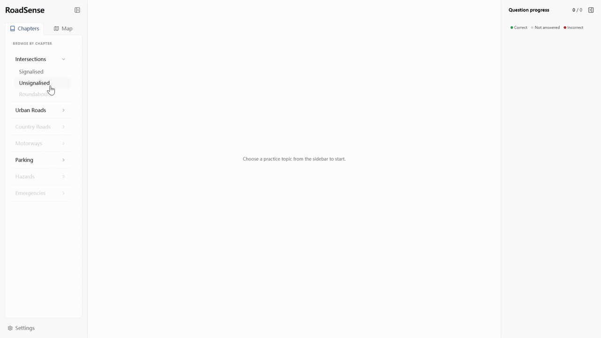

# RoadSenseNZ

RoadSenseNZ is an interactive web prototype for practising driving decisions on New Zealand roads. Learner drivers explore 2D scenes, choose an answer, and see explanations and animated outcomes.

**[Live Demo](https://roadsense-nz.vercel.app/)** · [Developer setup](app/README.md)

## Demo



## Why I Built It

I started RoadSenseNZ from my own experience as a learner driver in New Zealand. Learning the rules helped, but applying them to tricky road situations was a separate challenge. I wanted a way to explore those situations before encountering them on the road: observe other road users, make a choice, and understand its consequences.

## How It Works

1. Choose an available chapter or a practice location on the Auckland map.
2. Watch an animated scene or inspect a static sign or parking visual.
3. Answer a driving-decision question and read the feedback and explanation.
4. Replay the setup or watch the selected answer's outcome where an animation is supplied.
5. Use the memory option to save your answers and progress locally in the browser's local storage and return to them later.

## Engineering Highlights

- **Typed, data-driven scenarios.** TypeScript contracts describe metadata, locations, questions, answers, explanations, and visual or animation data. Bundled scenario files are discovered by Vite and consumed by shared UI components, keeping content separate from rendering.
- **Playback calculations separated from rendering.** The engine computes object states from time, tracks, and keyframes without depending on React or Canvas. Interpolation, vehicle orientation, and traffic signal transitions can therefore be tested independently; Canvas handles drawing.
- **A reusable scenario/player flow.** Map entry and chapter navigation share the same practice components. Static visuals and animated scenes use a common question, answer, and feedback flow.
- **Behaviour-focused tests and CI.** Tests cover animation calculations, content integrity, answer selection, replay, browser persistence, and map runtime/attribution sanitization. GitHub Actions runs lint, tests, and the production build for application changes.

See the [architecture notes](app/docs/ARCHITECTURE.md) for the implementation and its tradeoffs.

## Tech Stack

React · TypeScript · Vite · Tailwind CSS · MapLibre GL / MapTiler · Canvas / SVG
Vitest · React Testing Library · GitHub Actions · Vercel

## AI-assisted Development

I built the early core design and initial implementation mainly by hand, including the scenario/data structure, animation engine, player flow, and initial React components. In later iterations, I used AI coding tools to help with UI and styling, feature implementation, refactoring, and debugging.

I used these tools to iterate faster while reviewing their suggested changes myself. I checked the resulting implementation with automated tests, lint, production builds, and manual browser checks.

## Testing and Quality

From `app/`, run:

```sh
npm run check
```

This runs ESLint, automated tests, and the TypeScript/Vite production build. The same command is used in CI. See [Testing](app/docs/TESTING.md) for coverage scope and manual checks; real Canvas/WebGL rendering and driving-rule accuracy are outside the automated suite.

## Project Structure

| Path | Purpose |
| --- | --- |
| `app/` | React practice application, configuration, and developer documentation. |
| `app/src/content/` | Scenario data, reusable road templates, and content guide. |
| `app/src/contracts/` | TypeScript contracts for scenarios and visuals. |
| `app/src/components/` | Practice navigation, map, player, and static visuals. |
| `app/src/engine/` | Playback calculations, drawing, and map runtime loading. |
| `docs/` | Promotional page and its static/media assets, including the README demo. |
| `.github/workflows/` | Automated project checks. |

## Getting Started

Use Node.js 22.13+ in the Node 22 release line, or Node.js 24, with npm.

```sh
git clone https://github.com/vittorio777/RoadSenseNZ.git
cd RoadSenseNZ/app
npm ci
npm run dev
```

Open the URL printed by Vite. Chapters work without a map key. To enable the map locally, copy `app/.env.example` to `app/.env.local` and set `VITE_MAPTILER_KEY` to your MapTiler browser key. Vite reads this value when the development server starts; restart it after changes. For Vercel, set the same variable in the project's environment settings before building and deploying. See the [map configuration details](app/README.md#environment-variables) for how the key reaches the browser.

See [developer setup and deployment](app/README.md) for configuration, scripts, and Vercel settings.

## Current Status

This is a prototype and portfolio project with nine bundled demo scenarios. Available content covers intersections, bus lanes, and roadside parking; some chapters remain disabled. Wellington map presets exist, but no Wellington scenarios are supplied.

Progress is browser-local, with no account system or cross-device sync. Animations follow predefined tracks. The project is not a traffic simulator or a validated driving education system.

## Documentation

- [Developer setup and deployment](app/README.md)
- [Architecture](app/docs/ARCHITECTURE.md)
- [Testing](app/docs/TESTING.md)
- [Scenario/content guide](app/src/content/SCENARIO_GUIDE.md)

## Copyright

Source code is publicly available for portfolio purposes. All rights reserved.
