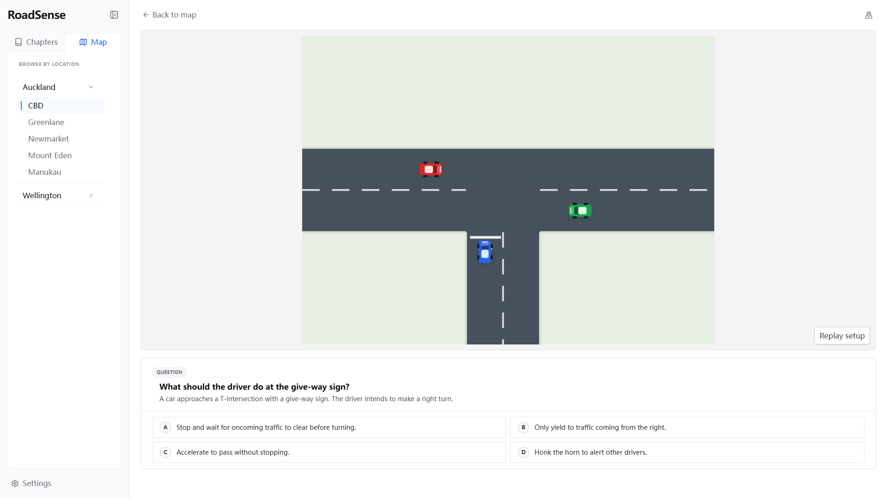
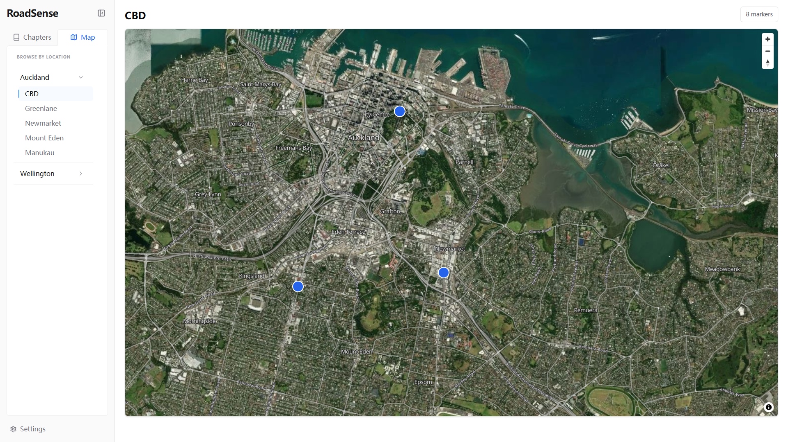

# RoadSense

An interactive frontend prototype for practising driving decisions on New Zealand roads.

[Live Demo](https://roadsense-nz.vercel.app/)



## Why RoadSense

RoadSense grew out of real learner-driver experience: knowing a road rule does not always make it easy to apply at a junction or interpret a sign. It helps learner drivers observe a visual situation, make a decision, and understand the answer before facing a similar situation on the road.

## What It Does

- Browse practice locations on an Auckland map or select available chapters for intersections, bus lanes, and roadside parking.
- Watch animated scenes or inspect static signs and parking-machine visuals.
- Answer questions and receive feedback with an explanation.
- Replay animated setups and view option-specific outcomes where supplied.
- Optionally save answers in the current browser.



## Tech Stack

React 19 · TypeScript 6 · Vite 8 · Tailwind CSS 4 · MapLibre GL / MapTiler · Canvas and SVG · Vitest / React Testing Library

## Engineering Highlights

- **Typed, data-driven scenarios.** Scenario files combine location metadata, questions, answers, explanations, and visual data. Vite discovers them automatically; shared templates and parking visuals are reused across questions.
- **Reusable practice components.** Chapter and map navigation use the same scenario player, coordinating questions, feedback, replay, and chapter navigation.
- **Playback separated from rendering.** The engine calculates object states from time and keyframes. Canvas draws animated scenes; static visuals combine images with SVG text and annotations.
- **Local progress.** Answers are stored by scenario ID in local storage, restored on return, and cleared when the memory setting changes. No account or backend is required.
- **Behavioural tests.** Tests cover playback, scenario integrity, answer feedback, replay, persistence, and map attribution sanitization. Real Canvas and WebGL rendering require browser checks.

## Project Structure

The repository contains the promotional site in `docs/` and the practice app in `road-master/`. Within the app:

| Directory | Purpose |
| --- | --- |
| `src/components/` | Practice interface, map, player, and static visuals. |
| `src/content/` | Scenarios, reusable road templates, and content guide. |
| `src/contracts/` | TypeScript types for scenarios and visuals. |
| `src/engine/` | Animation calculations and Canvas drawing. |
| `src/config/` | Chapter labels and map regions. |
| `public/scenario-assets/` | Static question images. |

See the [Scenario Content Guide](src/content/SCENARIO_GUIDE.md) and [Architecture Notes](docs/ARCHITECTURE.md).

## Getting Started

Use Node.js 22.13+ within the Node 22 release line, or Node.js 24, with npm. The app's `.nvmrc` selects Node 22.

```sh
git clone https://github.com/vittorio777/RoadSenseNZ.git
cd RoadSenseNZ/road-master
npm ci
npm run dev
```

Open the URL printed by Vite, usually `http://localhost:5173`. Without a map key, the map shows a configuration message; use **Chapters** to practise.

### Enable the map

Create a MapTiler API key, copy `.env.example` to `.env.local` next to `package.json`, and set:

```dotenv
VITE_MAPTILER_KEY=your_maptiler_api_key
```

The app also accepts `VITE_MAPTILER_API_KEY`. Use a browser-access key and allow your local origin in its settings. The key is included in the frontend bundle; `.env.local` is ignored by Git. Restart Vite after changing it. MapLibre and its worker are bundled locally; map styles and tiles require internet access to MapTiler.

### Build and check

| Command | Purpose |
| --- | --- |
| `npm run build` | Check TypeScript and build into `dist/`. |
| `npm run preview` | Preview an existing production build. |
| `npm test` | Run automated tests once. |
| `npm run test:watch` | Run tests while developing. |
| `npm run lint` | Check code with ESLint. |
| `npm run check` | Run lint, tests, and the production build. |

GitHub Actions is configured to run these checks on application pushes and pull requests. Tests need no map key. See [Testing](docs/TESTING.md) for scope and manual checks.

These instructions and CI use npm. A pnpm lockfile is retained; avoid mixing package managers when updating dependencies.

## Deployment

The [live app](https://roadsense-nz.vercel.app/) is hosted on Vercel. For a Vite deployment, use:

| Setting | Value |
| --- | --- |
| Project root | `road-master` |
| Build command | `npm run build` |
| Output directory | `dist` |
| Environment variable | `VITE_MAPTILER_KEY` |

Set the key before building and allow the deployed origin in MapTiler. Vite embeds the value at build time. The generated files can also be served by a static host. Vercel account settings and deployment triggers are configured outside this repository.

## Current Status

This is a prototype and portfolio project with nine bundled demo scenarios. Some chapters remain disabled, including the motorway chapter despite its bundled example. Wellington presets are available, but no Wellington scenarios are supplied.

Progress is browser-local, with no accounts or cross-device sync. Animations follow predefined tracks; this is not a traffic simulation. City filtering uses addresses, while area presets change the viewport. Tests validate application behaviour and content structure, not driving-rule accuracy or real map rendering.

## Copyright

Source code is publicly available for portfolio purposes. All rights reserved.
